<!-- ============ BANNER (edit text in banner.svg) ============ -->

  

# Joemon Johnson

**IAM Engineer → Consultant** · Leipzig, Germany

<!-- Restore these two badges once the portfolio site is live and the Credly handle is filled in — they currently 404:

-->

---

## About

~2 years hands-on Okta/IAM delivery in India → **Werkstudent IAM in Germany**.

## Kurzprofil 🇩🇪

IAM-Engineer mit rund zwei Jahren Praxiserfahrung (Okta, Microsoft Entra ID, Keycloak, MidPoint), derzeit Werkstudent im IAM-Bereich. Ich suche eine Festanstellung als **IAM Engineer / IAM Consultant** im DACH-Raum.

- 📍 Leipzig, Deutschland
- ✅ Gültige Aufenthalts- und Arbeitserlaubnis bis September 2027 — **kein Visa-Sponsoring erforderlich**
- 🎓 Okta Certified Professional · Microsoft SC-300 / SC-100 · AZ-104
- 🗣️ Deutsch A2 (Ziel: Goethe B1, Juli 2026) · Englisch fließend

---

## IAM capability matrix

| Layer | Tools | What I do with them |
|---|---|---|
| **IGA** | MidPoint | Role mining, role models, JML automation, SoD policy |
| **Identity Provider** | Keycloak | OIDC/SAML federation, realms, brokering, custom flows |
| **Cloud Identity** | Microsoft Entra ID | Conditional Access, PIM, app registrations, governance |
| **ITSM** | ServiceNow | Access request workflows, IAM integration patterns |
| **Workforce IdP** | Okta | Lifecycle, SSO, MFA, API hooks |

---

## Certifications

All claimed on Credly — verification links are being added to this page; proof available on request.

- **Okta Certified Professional**
- **Microsoft SC-300** — Identity and Access Administrator
- **Microsoft SC-100** — Cybersecurity Architect
- **Microsoft SC-900** — Security, Compliance, and Identity Fundamentals
- **Microsoft AZ-104** — Azure Administrator
- **Microsoft AZ-900** — Azure Fundamentals

<!-- Restore once the real handles are filled in — these currently 404:
➡ [Verify all credentials](https://www.credly.com/users/<TODO-credly-handle>) · [Microsoft Learn transcript](https://learn.microsoft.com/en-us/users/<TODO-ms-handle>/transcript/<TODO-share-id>)
-->

---

## Featured work

- **[CyberLens](https://github.com/JOE07here/cyberlens)** — browser-only risk scanner for non-human / AI-agent identities: correlates MidPoint + Keycloak exports and ranks over-privilege, dormancy, SoD and standing-credential risks (Next.js, TypeScript) · [live demo](https://joe07here.github.io/cyberlens/)
- **[MidPoint provisioning lab](https://github.com/JOE07here/iam-labs/tree/main/labs/01-midpoint-provisioning)** — end-to-end JML pipeline: HR source → midPoint 4.8 → OpenLDAP target, six-container Docker stack
- **[MidPoint RBAC + SoD Lab](https://github.com/JOE07here/iam-labs/tree/main/labs/02-midpoint-rbac-sod)** — role mining → role model → SoD policy on `demo.evolveum.com`
- **[Keycloak federation lab](https://github.com/JOE07here/iam-labs/tree/main/labs/03-keycloak-federation)** — OIDC brokering, custom authenticator flows
- **Zero Trust thesis** — MidPoint & Keycloak vs NIST SP 800-207 control mapping
- **[Lernkarten](https://github.com/JOE07here/lernkarten)** — spaced-repetition flashcard app I built for my own German A1 prep (React + Vite + Firebase) · [live app](https://joe07here.github.io/lernkarten/)
- **[Node blog platform](https://github.com/JOE07here/Node_blog_application)** — full-stack CRUD app (Node.js, Express, React, PostgreSQL) with Docker + Kubernetes deployment and CI/CD
- **IAM portfolio site** — Astro + Tailwind, bilingual (EN/DE), GitHub Pages *(in progress)*

Every lab writeup follows: *Problem → What I built → How it maps to a real IAM concept (JML / RBAC / SoD / ZTA) → Diagram → What broke & what I learned.*

---

## Skills

**IAM platforms**

**Authentication & access security**

**Identity lifecycle & governance**

**Standards & protocols**

**Enterprise integrations**

**Cloud**

**Databases**

**Scripting & automation**

**Operating systems & networking**

**Languages**

**Frontend**

**Backend & data**

**DevOps & tooling**

---

## Languages

- 🇬🇧 **English** — fluent
- 🇩🇪 **German** — B1
- 🇮🇳 Malayalam — native

---

## GitHub stats

---

## Get in touch

Hiring for IAM / Identity Engineer / IAM Consultant roles in DACH? Let's talk.

📧 [joemonjohnsonme@gmail.com](mailto:joemonjohnsonme@gmail.com) · 💼 [LinkedIn](https://www.linkedin.com/in/joemon-johnson)
<!-- Restore once the portfolio site hosts the CV: · 📄 [Download CV](https://JOE07here.github.io/cv.pdf) -->
